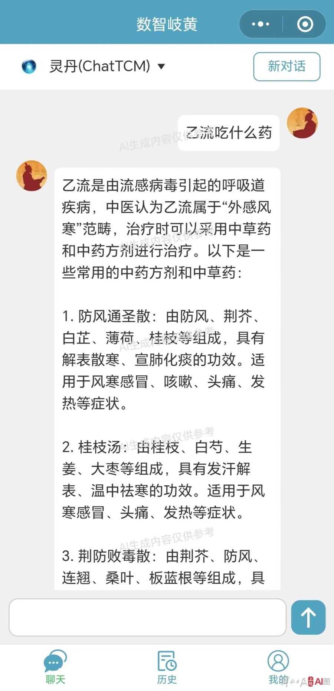

# shuzhiqihuan
## recommend
1. 多家高校和科研机构联合研发的“数智岐黄”中医药大模型,这个中医药大模型是“中西医结合”模式，成为全面融合中西药数据与知识的智能系统，支持向量检索，精确提供生成式输出，以支持中西医药物研发与医疗决策。
## representation 
- 微信小程序数值岐黄

- web端  

## news
[华东师范大学]('https://www.ecnu.edu.cn/info/1426/65503.htm')
[东方财富网](https://finance.eastmoney.com/a/202401192967327786.html)
[上海科技报](https://www.shkjb.com/content.html?id=231757)
[科学网](https://news.sciencenet.cn/htmlnews/2024/1/516371.shtm)

## aboutme 

